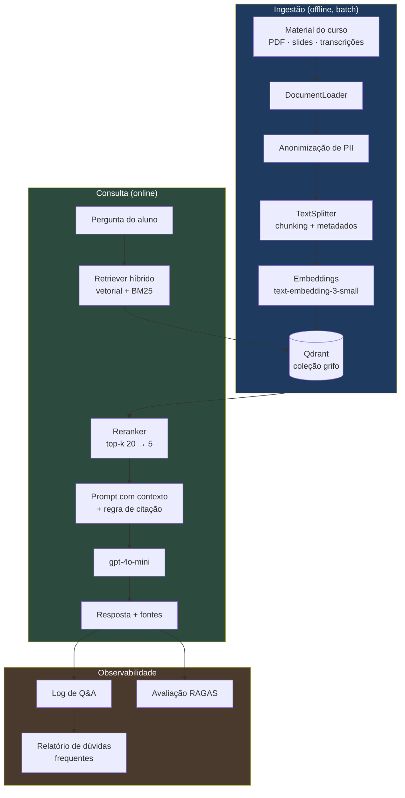

# Arquitetura — Grifo

Requisitos: [SPEC.md](SPEC.md)

---

## Visão geral

## Mapa de módulos

| Caminho | Responsabilidade | Requisitos |
|---|---|---|
| [src/grifo/ingest/loaders.py](src/grifo/ingest/loaders.py) | PDF, VTT/SRT, Markdown → `Document` | FR-10, FR-11 |
| [src/grifo/ingest/anonymize.py](src/grifo/ingest/anonymize.py) | Remoção de PII | FR-12, FR-52 |
| [src/grifo/ingest/chunker.py](src/grifo/ingest/chunker.py) | Split estrutural + tamanho, metadados DC-1 | FR-13, FR-16 |
| [src/grifo/ingest/pipeline.py](src/grifo/ingest/pipeline.py) | Orquestra a ingestão, CLI | FR-14, FR-15 |
| [src/grifo/retrieval/vector_store.py](src/grifo/retrieval/vector_store.py) | Wrapper do Qdrant | FR-20 |
| [src/grifo/retrieval/hybrid.py](src/grifo/retrieval/hybrid.py) | Vetorial + BM25 + RRF | FR-21, FR-22, FR-24 |
| [src/grifo/retrieval/rerank.py](src/grifo/retrieval/rerank.py) | Cross-encoder | FR-23 |
| [src/grifo/generation/prompts.py](src/grifo/generation/prompts.py) | Prompt com regra de citação | FR-31, FR-32, FR-35 |
| [src/grifo/generation/chain.py](src/grifo/generation/chain.py) | Chain LCEL | FR-30, FR-33, FR-36 |
| [src/grifo/api/main.py](src/grifo/api/main.py) | FastAPI | FR-40 a FR-44 |
| [src/grifo/api/schemas.py](src/grifo/api/schemas.py) | Contratos Pydantic (DC-2) | FR-40 |
| [src/grifo/analytics/question_log.py](src/grifo/analytics/question_log.py) | Log e relatório de dúvidas | FR-50, FR-51, FR-52 |
| [src/grifo/config.py](src/grifo/config.py) | Configuração por ambiente | NFR-7 |
| [app/streamlit_app.py](app/streamlit_app.py) | UI de chat | FR-60 a FR-63 |

---

## ADR 001 — Busca híbrida, não só vetorial

**Status:** aceito · **Data:** 2026-08-23

**Contexto.** Material de curso é cheio de jargão, nomes de frameworks e siglas. Busca puramente semântica erra quando o aluno pergunta pelo nome exato de uma ferramenta citada uma única vez no material: o embedding dilui o termo raro no significado geral do trecho.

**Decisão.** Retriever híbrido — busca vetorial no Qdrant somada a BM25 sobre o mesmo corpus, com os rankings fundidos por Reciprocal Rank Fusion. Pesos iniciais `(0.6, 0.4)`, calibrados contra o golden set.

**Consequências.** Ganho real em consultas factuais e por sigla, ao custo de manter um índice léxico em paralelo ao vetorial e de mais um parâmetro a calibrar. Sob pressão de prazo, este é o primeiro componente a ser cortado (SPEC 11) — a avaliação vale mais que o retriever sofisticado.

**Emenda (2026-08-23).** A primeira implementação intersectava os rankings: só entrava no resultado o chunk que a busca vetorial já tinha trazido. Isso anulava a decisão — o BM25 reordenava, mas nunca recuperava. Medido no corpus real, "O que é o Pulse?" devolvia zero chunks embora o termo apareça 8 vezes numa aula, porque o cosseno daquele chunk contra a pergunta é 0,026.

O retriever passou a **resgatar**: um chunk fora do top-k vetorial entra se casar um termo que alguma aula do corpus ensina. O critério não pode ser IDF puro (`pulse` 7,3 e `bolo` 7,1 são igualmente raros) nem frequência (4 e 5 chunks): é a concentração da ocorrência numa aula. Números e ablação em [EVALUATION.md](EVALUATION.md) seção 4.4.

Consequência para o ADR 002: o gate de recusa deixa de ser só cosseno. Um candidato resgatado entra por evidência léxica, e quem decide se ele responde a pergunta é o LLM. Os dois gates em série é que sustentam a meta de recusa correta.

---

## ADR 002 — Citação obrigatória, recusa permitida

**Status:** aceito · **Data:** 2026-08-23

**Contexto.** Num contexto educacional, um aluno que recebe informação errada com confiança está pior do que um aluno sem resposta. Ele estuda o errado e não sabe disso.

**Decisão.** O sistema prefere dizer que não sabe. Toda afirmação cita `[Módulo X, Aula Y]`; quando o retrieval não passa do `SCORE_THRESHOLD`, a resposta é exatamente `"Não encontrei isso no material do curso."` e a API devolve `found: false`. A regra é reforçada em três camadas: no prompt, no threshold de retrieval e em teste automatizado.

**Consequências.** Alguma perda de cobertura — o bot recusa perguntas que talvez conseguisse responder por aproximação. É o trade-off desejado. A taxa de recusa correta vira métrica pública do projeto (meta > 0.95), e o `found: false` exposto na API é honestidade de engenharia visível.

---

## ADR 003 — Chunking consciente de estrutura

**Status:** aceito · **Data:** 2026-08-23

**Contexto.** Chunking por tamanho fixo corta no meio de uma explicação e destrói o contexto que o LLM precisa. Pior: um chunk que atravessa a fronteira de duas aulas produz citação errada, e citação errada é pior que ausência de citação.

**Decisão.** Split em dois estágios — primeiro por estrutura (seção, aula, capítulo), depois por tamanho dentro de cada unidade, com overlap. Cada chunk carrega `modulo`, `aula` e `timestamp_inicio` ou `pagina`. A validação do schema DC-1 falha alto na ingestão.

**Consequências.** Loaders precisam extrair estrutura, não só texto, o que empurra complexidade para o começo do pipeline. É onde o investimento de tempo compensa mais: chunking é o maior determinante de qualidade num RAG. Quando `timestamp_inicio` está preenchido, a citação vira link direto para o minuto do vídeo — o detalhe que faz a demo funcionar.
