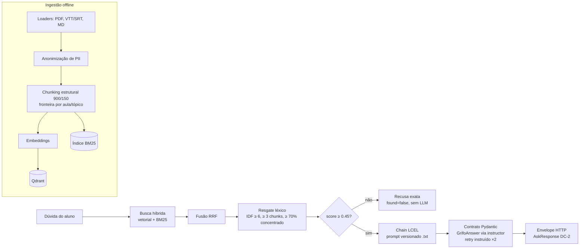
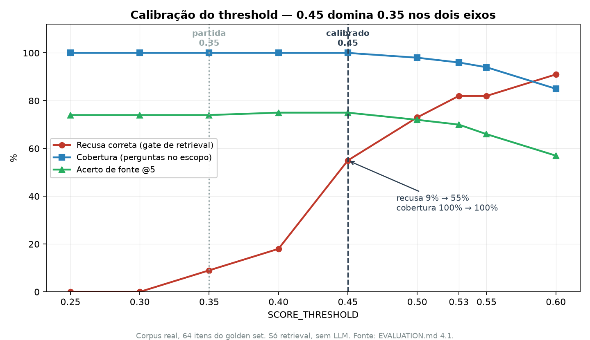

# Grifo

**Assistente de dúvidas para cursos online. Responde só com o material oficial, cita módulo, aula e o minuto do vídeo — e recusa quando a resposta não está lá.**

[](https://github.com/btaguiar/grifo/actions/workflows/ci.yml)


> **Status:** pipeline completo com avaliação de ponta a ponta, contrato de saída
> validado por Pydantic, série temporal de métricas e juiz de alucinação calibrado
> (κ = 0.905). Aberto e datado: latência acima da meta com o contrato (3,5s vs 3s), e
> a alucinação do corpus real segue não sustentada porque um 7B julgou a si mesmo.
> Nenhum número aqui é estimativa: ou foi medido, ou está vazio.

---

## 1. O problema

Aluno de curso online trava às 23h. A resposta existe — está num vídeo de 40 minutos,
módulo 3, aula 7, minuto 22 — e o suporte responde as mesmas 20 perguntas toda semana.
O problema não é falta de conteúdo, é **recuperação** de conteúdo — e a resposta
errada dada com confiança é pior que nenhuma resposta.

Grifar é marcar o trecho certo no material. É o que o projeto faz: responde **só** com
o material oficial, cita onde está, e recusa quando não está.

## 2. Métricas

Dois corpora, dois setups, denominadores explícitos e o comando que gera cada número
ao lado. Metodologia, calibração e análise de erro em [EVALUATION.md](EVALUATION.md).

| Métrica | Denominador | Meta | Corpus real, LLM local | Corpus de exemplo, LLM remoto | Reproduzir |
|---|---|---|---|---|---|
| **Taxa de recusa correta** | 11 fora do escopo | > 0.95 | **1.00** (11/11) | **1.00** (11/11) | `python eval/run_eval.py` |
| **Taxa de alucinação** | respondidas | < 2% | 0.00 (0/44) — não sustentada¹ | **0.00** (0/33)¹ | `python eval/run_eval.py` |
| **fonte@5** — retrieval puro | 53 em escopo | — | **0.79** | — | `python eval/calibrar_retrieval.py --ablacao` |
| **Fonte correta nas respondidas** | respondidas | — | **0.82** (36/44) | **0.97** (32/33) | `python eval/run_eval.py` |
| **Citação espontânea** | respondidas | — | **0.80** (35/44)² | **1.00** (33/33, contrato)³ | `python eval/run_eval.py` |
| **Cobertura de conteúdo** | respondidas com gabarito | ≥ 0.90 | — | **0.95** / 0.94 (n=33) | `python eval/run_eval.py` |
| Faithfulness (RAGAS) | respondidas | > 0.90 | — | 0.87 — **não atinge** | `python eval/run_eval.py` |
| Context Precision (RAGAS) | respondidas | > 0.75 | — | **0.96** | `python eval/run_eval.py` |
| Answer Relevance (RAGAS) | respondidas | > 0.80 | — | **0.84** | `python eval/run_eval.py` |
| Retry de validação do contrato | todas as perguntas | — | — | **0.000** (55/55 de primeira) | `python eval/run_eval.py` |
| **Latência p95** | todas as perguntas | < 3s | 19,9s — não atinge | 3,53s — não atinge³ | `python eval/run_eval.py` |
| **Custo por query** | 55 perguntas | — | US$ 0 (local) | **~US$ 0.0001** | `python eval/run_eval.py` → `custo_usd` |

As colunas **não são comparáveis entre si**: corpora de tamanhos muito diferentes.
A série temporal (3 rodadas na configuração canônica congelada) está no
[EVALUATION.md §3.5](EVALUATION.md), com gráfico derivado dos `metricas_*.json`.

¹ **Cada 0.00 vale o que vale o juiz que o produziu, e os dois juizes são diferentes.**
Calibração em 97 casos, mesmo prompt, `python eval/calibrar_juiz.py`
([EVALUATION.md 5.9](EVALUATION.md)):

| Juiz | κ | Recall | Precisão | Vale para |
|---|---|---|---|---|
| `openai/gpt-4o` | **0.905** | 0.879 | 1.000 | coluna do corpus de exemplo |
| `qwen2.5-7b` local | 0.408 | 0.364 | 0.923 | coluna do corpus real |

O `gpt-4o` passa o piso de 0.70, então o **0.00 da terceira coluna está liberado** — é a
primeira vez neste projeto. O da segunda **não**: aquela rodada é anterior ao
`EVAL_LLM_MODEL` e o próprio 7B que respondia foi quem julgou, com recall de 0.364 e
cegueira total a prazo e recomendação inventados. Um juiz assim devolve 0.00 quase
independentemente do dado. Ressalva que vale para os dois: 91 dos 97 rótulos foram
confirmados por verificação mecânica e só 6 por leitura humana.
² Medição da rodada de 2026-08-24, antes do `_ensure_citation` (EVALUATION.md 5.5) —
prompt antigo, `qwen2.5-7b` local. A citação **final** daquela rodada foi 1.00
(44/44) **pós-processada**: 9 respostas (20%) foram consertadas à força pela chain.
³ Rodada do contrato de saída Pydantic (2026-09-06, EVALUATION.md 3.4): citação validada
por Pydantic/instructor com retry instruído — 1.00 espontânea, zero re-validações. O
custo do contrato é publicado: p95 2,58s → 3,53s, tokens de entrada 361 → 561 por
pergunta. Custo por query derivado dos tokens medidos × preço público datado em
`config.py` (`custo_usd` no `metricas_*.json`).

**Três leituras que valem mais que os números** (detalhes no EVALUATION.md):

- 9 perguntas dentro do escopo foram recusadas indevidamente (17% no corpus real) — é
  o custo declarado da regra de recusa, invisível na taxa de recusa correta.
- As duas métricas de fidelidade discordam de forma informativa: o juiz próprio só
  acusa fato novo; o faithfulness do RAGAS pega elaboração. 5 itens com faithfulness
  < 0.70 foram aprovados pelo juiz — a divergência item a item está no 5.8.
- A latência que não atinge é do contrato, não do retrieval: a busca custa 30ms; o
  tool calling do structured output é o que pesa.

## 3. Arquitetura



Dois gates de recusa em série (ADR 002): o threshold do retrieval (barra o
desalinhado) e o próprio modelo via contrato (`found=false` com a string exata).
A citação sai do modelo validada — o par módulo/aula citado precisa existir entre os
trechos recuperados, senão o contrato reprova e o erro volta ao modelo.

Diagrama completo e os três ADRs em [ARCHITECTURE.md](ARCHITECTURE.md). Requisitos
com critério de aceite em [SPEC.md](SPEC.md).

**Stack:** Python 3.11 · LangChain (LCEL) · Qdrant · FastAPI · Pydantic + instructor ·
Streamlit · Docker Compose · GitHub Actions. O LLM e os embeddings entram por qualquer
API compatível com OpenAI, escolhida só por variável de ambiente — nenhum código muda
entre elas. Três setups em [.env.example](.env.example): **OpenRouter** (uma chave
para os dois, é o default), **OpenAI direto**, e **100% local** via LM Studio ou
Ollama.

**Privacidade.** O material do curso nunca entra no repositório: o `.gitignore` foi o
primeiro commit e cobre também os resultados brutos da avaliação (carregam o texto dos
trechos). Dois corpora, um código: o real fica local, o sanitizado em `samples/` é
commitado e é o que a demo e o CI usam. A ingestão anonimiza e-mail, telefone e CPF
antes de indexar. Com o setup local, embeddings **e** LLM rodam na máquina — nenhum
trecho do material sai dela.

## 4. Decisões medidas

A seção que diferencia este repositório: cada decisão de projeto tem o número que a
justificou e o link para a medição. Nenhuma veio de opinião.

| Decisão | O que a medição mostrou | Onde |
|---|---|---|
| **Reranker desligado** | cross-encoder `ms-marco-MiniLM` (inglês) reordenando português: fonte 77% → 74% **e** +613ms por pergunta | [4.4](EVALUATION.md) |
| **Resgate léxico com os 3 critérios** (IDF ≥ 6 + ≥ 3 chunks + 70% concentração) | só-IDF comprava 7pp de recall e **destruía a recusa** (82% → 27%); com os três, +6pp de recall sem custo nenhum | [4.4](EVALUATION.md) |
| **Threshold em 0.45** (partida 0.35) | recusa do gate 9% → 55% com a mesma cobertura e o mesmo acerto de fonte — ganho nos dois eixos, não trade-off | [4.1](EVALUATION.md) |
| **Juiz nunca num 7B** | mesmo prompt, mesmos 97 casos: `gpt-4o` dá κ 0.905 e recall 0.879; `qwen2.5-7b` dá κ 0.408 e recall 0.364, com cegueira TOTAL a prazo e recomendação inventados | [5.9](EVALUATION.md) |
| **Juiz binário** (SIM/NÃO, não Likert) | a versão "contém ALGUMA afirmação não sustentada?" reprovava paráfrase fiel e inflava a alucinação para 79,5% — quase todo falso positivo | [3.2](EVALUATION.md) |
| **BM25 mantido** (o plano de partida mandava cortá-lo) | sozinho vale +9pp de acerto de fonte; com o resgate, cobertura 100% | [4.4](EVALUATION.md) |
| **Contrato Pydantic em vez de regex** sobre a saída | citação 1.00 espontânea com 0 re-validações; custo publicado: p95 2,58s → 3,53s, +55% tokens de entrada | [3.4](EVALUATION.md) |
| **Pós-processamento de citação desligado** | o `_ensure_citation` anexava 20% das citações à força — atribuir fonte a afirmação não fundamentada; ficou como flag `FORCE_CITATION=false` | [5.5](EVALUATION.md) |



**O que eu faria diferente.** Mediria antes de decidir, e mais cedo: os três
parâmetros de partida do planejamento (threshold, reranker, BM25) estavam errados, e
nenhuma das descobertas exigia código novo — só a medição que eu podia ter feito na
primeira semana. E desconfiaria de componente que "funciona": os dois piores bugs
foram silenciosos (BM25 que reordenava sem resgatar; cache léxico servindo corpus
congelado pós-ingestão). Num RAG a falha silenciosa é o modo de falha padrão — o teste
que a pega tem de afirmar o que o componente *recupera*, não que ele rodou.

## 5. Limitações conhecidas

Declaradas para não serem lidas como promessas; detalhes no [EVALUATION.md §7](EVALUATION.md).

- **Sem tracing nem observabilidade de produção.** As medições são de avaliação
  offline; não existe traçado de requisição real (depende de tráfego que não há).
- **O `question_log` não tem tráfego real.** 7 linhas de smoke test, sem resposta nem
  chunks gravados — não é base para golden set.
- **Gabarito parcial.** `expected_answer_contains` é consumido (cobertura de
  conteúdo); um campo `reference` que destravaria o context recall do RAGAS foi
  decidido **não** fazer — razões documentadas.
- **Os rótulos da calibração do juiz são quase todos derivados, não lidos.** 91 dos 97
  foram confirmados por verificação mecânica (`eval/confirmar_rotulos.py`) e só 6 por
  leitura humana. A verificação é lexical: não alcança invenção feita só com palavras
  que já estão no contexto — inverter uma relação, trocar causa por consequência. O κ de
  0.905 mede o juiz contra fabricação **detectável**, não contra a distribuição real de
  erro de um LLM ([5.9](EVALUATION.md)).
- **A alucinação da linha de base do corpus real não está sustentada.** Aquela rodada foi
  julgada pelo próprio `qwen2.5-7b` que respondia (κ = 0.408, recall 0.364) — o restante
  do que ela mediu segue válido, a linha de alucinação não.
- **p95 acima da meta com o contrato** (3,5s vs 3s) — custo do structured output,
  publicado. O job de eval no CI está pronto atrás de `ENABLE_EVAL` e ligá-lo hoje
  reprova no p95: estado registrado, não silenciado.
- **Escopo v1:** um curso por índice (sem multi-tenant), sem autenticação de aluno,
  sem memória de conversa longa, sem streaming.
- As duas rodadas antigas (corpus real com 7B local; corpus público pré-contrato) não
  formam série entre si — a série canônica começou em 2026-09-06.

**Próximos passos, em ordem de impacto:** resolver a latência do contrato (streaming ou
prompt mais magro) e ligar o eval no CI; ampliar a fatia de rótulos com procedência
humana, que hoje são 6 de 97 e é o que faria o κ significar acordo com uma pessoa;
re-medir o corpus real com o contrato e com juiz `gpt-4o`, que é o que falta para a
alucinação daquela coluna deixar de ser não sustentada.

## 6. Rodar

```bash
cp .env.example .env               # preencha só OPENAI_API_KEY
docker compose up -d               # sobe Qdrant + API + UI
docker compose run --rm ingest     # indexa o corpus de exemplo
```

- API e Swagger: http://127.0.0.1:8000/docs
- UI de chat: http://127.0.0.1:8501

Pergunte *"Como calcular o CAC?"* e você recebe a resposta com a aula citada. Pergunte
*"Qual a receita do bolo de cenoura?"* e recebe a recusa — que é o comportamento
correto. As duas respostas estão certas, e é a segunda que quase ninguém mede.

A primeira build baixa PyTorch e leva alguns minutos. A ingestão roda dentro do
container: você não precisa de Python na máquina. Custo de rodar a avaliação sobre o
corpus de exemplo: **US$ 0,007 por rodada** (tokens medidos × preço público — ver
`custo_usd` no resultado). Para custo zero e nada saindo da máquina, use o setup
local do `.env.example`.

Desenvolvimento:

```bash
python -m venv .venv && .venv\Scripts\activate
pip install -e ".[dev]"
pytest                                # 159 testes, sem serviços externos
pytest -m integration                 # 4 testes, exigem Qdrant no ar
python eval/calibrar_retrieval.py     # varreduras de calibração (sem LLM)
python eval/run_eval.py               # suite completa de avaliação
python eval/triagem_calibracao.py     # audita os rótulos da calibração (sem LLM)
python eval/calibrar_juiz.py          # kappa + matriz de confusão do juiz
python eval/gate_regressao.py         # gate contra a última rodada da série
python eval/serie_temporal.py         # gráfico da série (docs/serie-temporal.png)
pip-audit                             # vulnerabilidades conhecidas nas dependências
```

---

Documentação: [SPEC.md](SPEC.md) · [ARCHITECTURE.md](ARCHITECTURE.md) · [EVALUATION.md](EVALUATION.md) · [CHANGELOG.md](CHANGELOG.md) · [Plano de execução](docs/plano-execucao.md)
